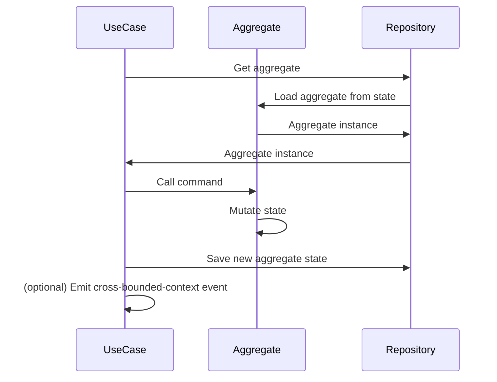
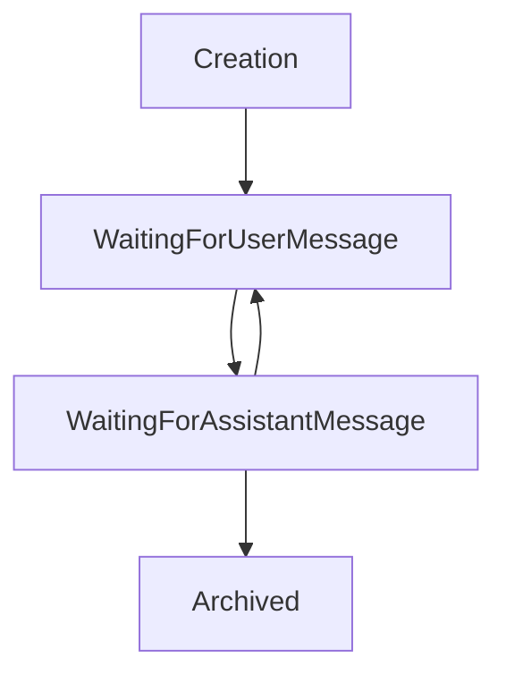

# Aggregate

The project follows Domain-Driven Design and therefore the aggregate pattern.
In order to limit implementation complexity, we have decided against using Event Sourcing, and 
to only persist the state of the aggregates in the database.

Here are the typical methods found in an aggregate:

- Static ```from``` method: Creates an instance of the aggregate from a given state.
- Static factory method: Initial command that creates an instance of the aggregate.
- Commands: Public methods that mutate the state of the aggregate and maintain its invariants.
- Mutate method: private method that mutates the state of the aggregate using the current state and an aggregate event

The state of the aggregate should be stored under a state property in the aggregate.
Aggregate states should have a type, with clear allowed transitions. More on this in the State Types section.

## Aggregate events

In order to change its state, an aggregate emits events and updates its state using the mutate method.

Examples of aggregate events:

- THREAD_CREATED: emitted when a thread is created
- USER_MESSAGE_POSTED: emitted when a user message is posted
- ASSISTANT_RESPONSE_RECEIVED: emitted when an assistant response is received

Each event should have a type and a (possibly empty) payload.

Example of payloads:
- THREAD_CREATED: { threadId: string }
- USER_MESSAGE_POSTED: { message: string }
- ASSISTANT_RESPONSE_RECEIVED: { response: string }

## Use-case / aggregate sequence diagram

The following diagram shows the typical interaction between a use-case, an aggregate, and a repository.



## State types

Aggregate states should have a type, with clear allowed transitions. For example,
a `Thread` aggregate could have the following states:


