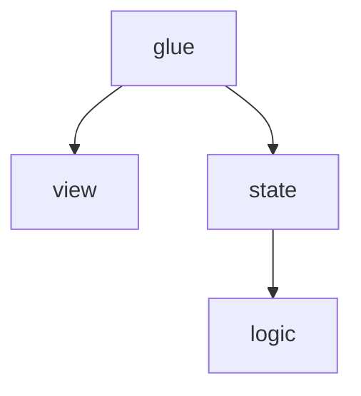

# Anatomy of a component

## A useful mental model

I like to think of UI components as being made up of three layers:

- View layer: this layer defines what the user sees (tsx code with html, css / tailwind classes, etc.)
- Reactive State layer: this layer is responsible for maintaining the reactive state of the application and making it accessible to
  the view layer. In most cases, it leverages the capabilities of a reactive framework such as React.js View.js, or Angular
- Logic layer: this layer is responsible for handling all the business logic of the component. Its code is generally made up of pure functions.

Additionally, there is a fourth implicit "Glue" layer, which is responsible for connecting the view and the state together.

Here is how they look on a dependency graph:



## What it looks like in practice

How you define the different in the code is really up to you. If the component is simple enough, they could live in a single file:

```tsx
// counter.tsx

// glue + view layers
export function Counter() {
  const { count, increment } = useCounter();

  return (
    <div>
      <h1>{count}</h1>
      <button onClick={increment}>Increment</button>
    </div>
  );
}

// state + logic layer
function useCounter() {
  const [count, setCount] = useState(0);

  const increment = () => setCount((prev) => prev + 1);

  return { count, increment };
}
```

However, if the components gets more complex, you may consider breaking them down in different files, for instance:

- `counter.logic.ts` : Logic layer (notice the lack of a tsx extension !)
- `counter.state.tsx` : State layer ("Headless component")
- `counter.view.tsx` : View layer
- `counter.tsx`: Glue layer

```typescript
// counter.logic.ts

export function increment(count: number): number {
  return count + 1;
}

export function initCount(): number {
  return 0;
}
```

```tsx
// counter.state.tsx

export function useCounter() {
  const [count, setCount] = useState(initCount());

  const incrementCount = () => setCount((prev) => increment(prev));

  return { count, increment: incrementCount };
}
```

```tsx
// counter.view.tsx

export function CounterView({
  count,
  increment,
}: {
  count: number;
  increment: () => void;
}) {
  return (
    <div>
      <h1>{count}</h1>
      <button onClick={increment}>Increment</button>
    </div>
  );
}
```

```tsx
// counter.tsx
export function Counter() {
  const { count, increment } = useCounter();

  return <CounterView count={count} increment={increment}>
}
```

## Benefits

This sure seems like a lot of boilerplate and is probably overkill for our little Counter. However, as components grow and logic becomes more complicated, this separation of the different concerns provides key benefits.

### Testability

Testing always seem to be quite chaotic in the frontend world. From my experience, there are different categories of tests that we can write for the frontend:

- E2E / Browser tests. These tests require using a framework such as Playwright or Cypress. They are the most realistic, but also the slowest and the expensive to write.
- In memory component tests. These tests leverage framework-specific libraries (such as the react-testing-library) to enable you to mount and tests components in-memory. They are fast and a bit cheaper to write, but they also require you to interact with the DOM.
- Headless component tests. These tests also leverage the react-testing-library. They don't require you to interact with the DOM, but they often require quite a bit of boilerplate.
- Function tests. These tests verify the output of pure functions of the logic layer. They are the narrowest and the cheapest to write.

For our little Counter, in-memory component tests would probably be enough. However, as the component and the logic grows, they may become impractical.
First, consider splitting the state and business logic into a hook. You can then start writing tests that don't rely on the DOM. If the component grows even more the react-testing-library becomes impractical, you can
isolate the logic into its own file and write narrowly focused function tests.

### Maintainability
