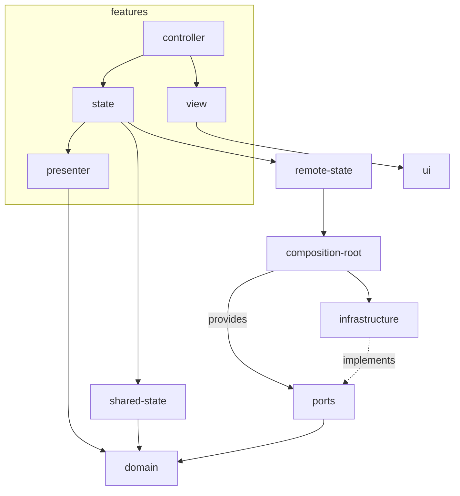

# Structuring a frontend project

## Folder structure

Let's start by looking at the overall folder structure, then we will break it down.

```
.
├── src
│   ├── domain
│   │   ├── thread.ts
│   │   ├── thread.spec.ts
│   ├── ports
│   │   ├── threads.repository.ts
│   │   ├── threads.repository.fake.ts
│   ├── infrastructure
│   │   ├── threads.repository.http.ts
│   │   ├── threads.repository.http.spec.ts
│   ├── composition-root
│   │   ├── threads.repository.singleton.ts
│   ├── features
│   │   ├── chat
│   │   │   ├── chat.controller.tsx
│   │   │   ├── chat.controller.spec.tsx
│   │   │   ├── chat.view.tsx
│   │   │   ├── chat.state.tsx
│   │   │   ├── chat.presenter.ts
│   │   │   ├── chat.presenter.spec.ts
│   │   │   ├── index.ts
│   │   ├── chat-history
│   │   ├── chat-page
│   ├── remote-state
│   │   ├── use-list-threads.query.tsx
│   │   ├── use-get-thread.query.tsx
│   │   ├── use-create-thread.mutation.tsx
│   │   ├── use-post-message.mutation.tsx
│   ├── ui
│   │   ├── button.tsx
│   │   ├── text-area.tsx
│   │   ├── modal.tsx
│   ├── index.ts (public API of the library)
```

### Domain

The domain directory contains domain-specific models and services. 
The domain should not rely on the view framework (React/Vue/Angular), and instead contain framework-agnostic code
that focus on the modelisation of the business rules.

### Ports

External adapters interfaces that enable the application to communicate with remote services, and enable component
and unit testing through fake implementations.

### Infrastructure

Implementations of the interfaces, such as a HTTP client for a backend application.

### Composition root

Providers for the infrastructure.

### Remote-state

Hooks that enable management of the remote state and its associated meta-state (isLoading, isPending, etc.). 
They rely on the ports/infrastructure layers.

### UI

Shared, reusable, view-only components.

### Features

Features make up most of the application. They are then wired-up into the pages of the whole application. Features can 
import other features.

Each feature's API should be kept to the absolute minimum possible. The principle of least knowledge is paramount when
designing feature: A feature's consumer shouldn't need to know anything about the feature's implementation details to 
be able to use it.

## Dependency graph


