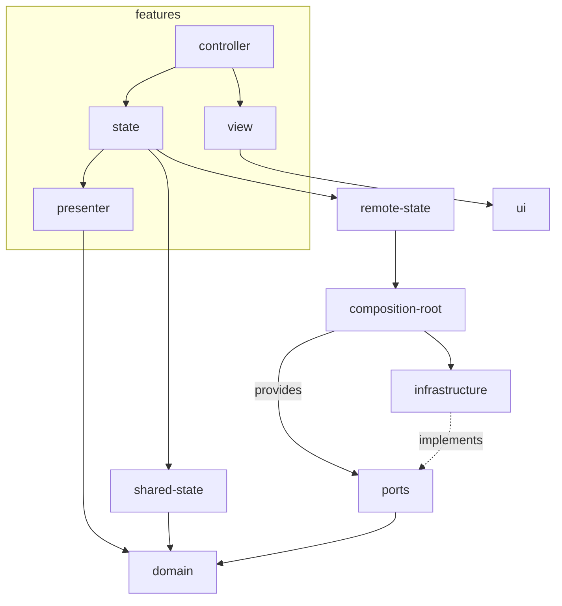

# Structuring a frontend project

## Folder structure

Let's start by looking at the overall folder structure, then we will break it down.

```
.
├── src
│   ├── domain
│   │   ├── thread.ts
│   │   ├── thread.spec.ts
│   ├── ports
│   │   ├── threads.repository.ts
│   │   ├── threads.repository.fake.ts
│   ├── infrastructure
│   │   ├── threads.repository.http.ts
│   │   ├── threads.repository.http.spec.ts
│   ├── composition-root
│   │   ├── threads.repository.singleton.ts
│   ├── features
│   │   ├── chat
│   │   │   ├── chat.controller.tsx
│   │   │   ├── chat.controller.spec.tsx
│   │   │   ├── chat.view.tsx
│   │   │   ├── chat.state.tsx
│   │   │   ├── chat.presenter.ts
│   │   │   ├── chat.presenter.spec.ts
│   │   │   ├── index.ts
│   │   ├── chat-history
│   │   ├── chat-page
│   ├── remote-state
│   │   ├── use-list-threads.query.tsx
│   │   ├── use-get-thread.query.tsx
│   │   ├── use-create-thread.mutation.tsx
│   │   ├── use-post-message.mutation.tsx
│   ├── ui
│   │   ├── button.tsx
│   │   ├── text-area.tsx
│   │   ├── modal.tsx
│   ├── index.ts (public API of the library)
```

## Dependency graph

