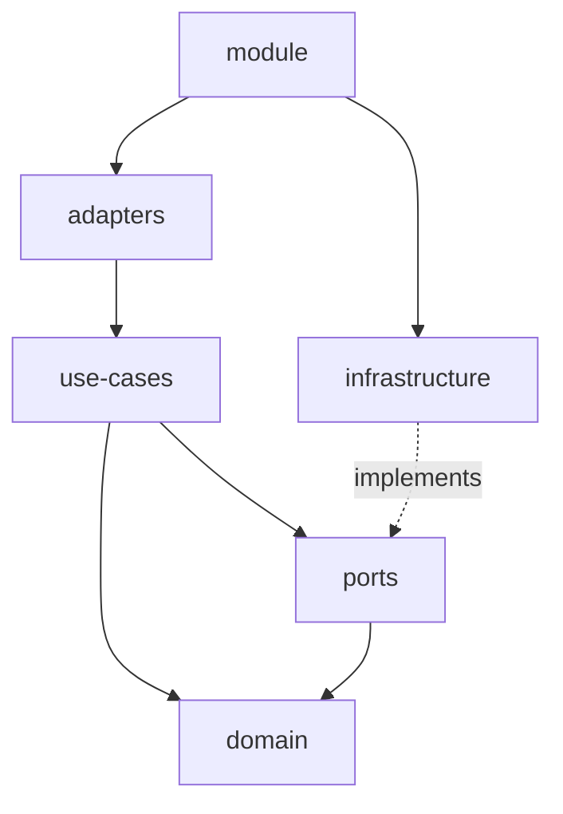
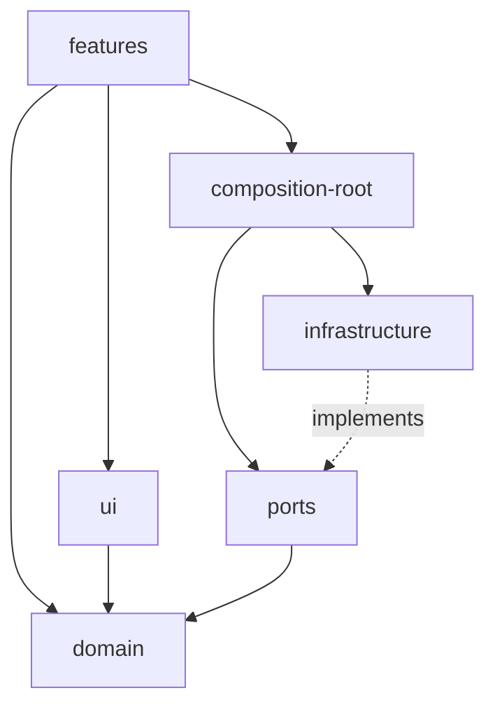

# Project structure

Recommended project structures for frontend and backend applications.

## Example

Here is an example project structure

```
.
├── apps
│   ├── server
│   ├── server-e2e
│   ├── web
│   ├── web-e2e
├── libs
│   ├── server
│   │   ├── auth
│   │   ├── threads
│   ├── web
│   │   ├── shared
│   │   │   ├── ui
│   │   │   ├── utils
│   │   ├── auth
│   │   ├── chat
├── package.json
├── README.md
```

## Apps

Apps are the entry points of the application. They are runnable and deployable units that work
on their own. It is at the app level that end-to-end tests are performed.

Apps should be kept as small as possible. They should not contain business logic, and instead focus
on composing the libraries.

Let's zoom in on the `server` app:

```
.
├── src
│   ├── app
│   │   ├── app.module.ts
│   ├── main.ts
├── Dockerfile
├── project.json
```

## Libraries

Libraries are the building blocks of the application. Backend libraries export modules. 
Frontend libraries export pages or self-contained components.

Libraries are of two types:
- Domain-oriented libraries
- Supporting libraries

### Domain-oriented libraries

Domain-oriented libraries correspond to what DDD calls a bounded context. They should be
structured following hexagonal architecture.

### Supporting libraries

Supporting libraries are shared libraries that can be used by multiple domain-oriented libraries.
Common examples are:
- Shared UI components that are purely presentational, and help provide a consistent look and feel
- Shared utils or providers that are purely technical and not related to the domain

### Server-side libraries folder structure

Let's zoom in on the `threads` library:

```
.
├── src
│   ├── domain
│   │   ├── thread.aggregate.ts
│   │   ├── thread.aggregate.spec.ts
│   │   ├── message.value-object.ts
│   ├── use-cases
│   │   ├── create-thread.ts
│   │   ├── create-thread.spec.ts
│   │   ├── list-threads.ts
│   │   ├── list-threads.spec.ts
│   │   ├── post-message.ts
│   │   ├── post-message.spec.ts
│   │   ├── archive-thread.ts
│   │   ├── archive-thread.spec.ts
│   ├── ports
│   │   ├── threads.repository.ts
│   │   ├── threads.repository.fake.ts
│   │   ├── threads.repository.fake.spec.ts
│   ├── infrastructure
│   │   ├── threads.repository.postgres.ts
│   │   ├── threads.repository.postgres.spec.ts
│   ├── adapters
│   │   ├── threads.controller.ts
│   ├── threads.module.ts
│   ├── index.ts
```

#### Domain
Domain is the core of the application. It contains domain-specific, framework-agnostic representation
of business entities and services.

Avoid having anemic domain models (i.e dumb data containers). Instead, prefer the Aggregate pattern, where an
aggregate is responsible for maintaining its business invariants.

#### Use-cases
Use-cases are the entry points of the application. They do not depend on external adapters such as HTTP or SQL directly,
but they interact with them through ports. They represent actions that users or external systems can perform.

#### Ports
Ports are interfaces that enable the use-cases to interact with the outside world. In pure hexagonal lingo, the ports of the
ports directory are primarily _driven_ ports. They can be used by the use-cases to load and persist data, send messages to
queues, etc.

#### Infrastructure
Infrastructure is the implementation of the ports. For example, where the threads repository is the interface that is used
by use-cases to load and persist threads, the implementation may use Postgres, DynamoDB, or other database technologies
to actually perform the storage.

#### Adapters
Adapters are the _driving_ ports of the application. They are responsible for translating incoming requests (HTTP, gRPC, 
SQS, etc.) into use-cases input, and output from use-cases into outgoing responses.

#### Dependency graph



### Client-side libraries folder structure

Let's zoom in on the `chat` library:

```
.
├── src
│   ├── domain
│   │   ├── message.ts
│   │   ├── chunck.ts
│   │   ├── thread.ts
│   ├── features
│   │   ├── chat.tsx
│   │   ├── chat.ct.tsx
│   │   ├── chat.store.ts
│   │   ├── chat.hook.ts
│   │   ├── chat.hook.spec.ts
│   │   ├── chat.page.tsx
│   ├── ui
│   │   ├── ChatInput.tsx
│   │   ├── ChatMessage.tsx
│   ├── ports
│   │   ├── chat.repository.ts
│   │   ├── chat.repository.fake.ts
│   ├── infrastructure
│   │   ├── chat.repository.http.ts
│   ├── composition-root
│   │   ├── chat.repository.singleton.ts
│   ├── index.ts
```

#### Dependency graph


