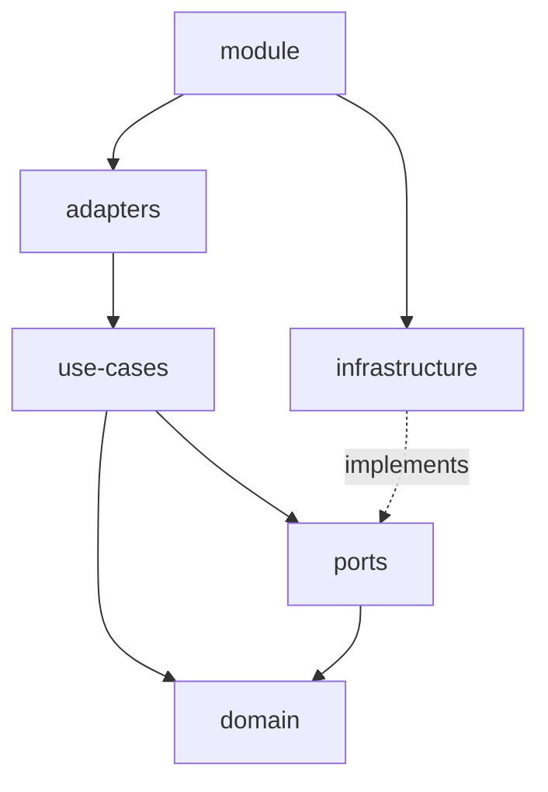

# Project structure

Recommended structure for backend projects

# Overall philosophy

Build a **modular** monolith until you absolutely need microservices.

## Apps

Apps are the entry points of the application. They are runnable and deployable units that work
on their own. It is at the app level that end-to-end tests are performed.

Apps should be kept as small as possible. They should not contain business logic, and instead focus
on composing the libraries.

Example structure:

```
.
├── src
│   │── app.module.ts
│   ├── main.ts
├── Dockerfile
```

It contains just enough code to run the application and deploy it as a docker image. However, most of the
code is contained in the libraries, and is simply composed in the app.module.ts file.

## Libraries

Libraries are the building blocks of the application. Backend libraries export modules. A library corresponds to a bounded context.

We aim at minimizing the API surface of libraries. They should only export three types of components:
- Controllers, that expose a REST, GraphQL, etc... API, meant to be consumed by external systems such as a web app
- Internal APIs, enabling interactions with other libraries
- Integration events for message-based communication with other libraries

### Folder structure

Let's zoom in on the `threads` library and break down its components:

```
.
├── src
│   ├── domain
│   │   ├── thread.aggregate.ts
│   │   ├── thread.aggregate.spec.ts
│   │   ├── message.value-object.ts
│   ├── use-cases
│   │   ├── create-thread.ts
│   │   ├── create-thread.spec.ts
│   │   ├── list-threads.ts
│   │   ├── list-threads.spec.ts
│   │   ├── post-message.ts
│   │   ├── post-message.spec.ts
│   │   ├── archive-thread.ts
│   │   ├── archive-thread.spec.ts
│   ├── ports
│   │   ├── threads.repository.ts
│   │   ├── threads.repository.fake.ts
│   │   ├── threads.repository.fake.spec.ts
│   ├── infrastructure
│   │   ├── threads.repository.postgres.ts
│   │   ├── threads.repository.postgres.spec.ts
│   ├── adapters
│   │   ├── threads.controller.ts
│   ├── threads.module.ts
│   ├── index.ts (public API of the library)
```

#### Domain
Domain is the core of the application. It contains domain-specific, framework-agnostic representation
of business entities and services.

Avoid having anemic domain models (i.e dumb data containers). Instead, prefer the Aggregate pattern, where an
aggregate is responsible for maintaining its business invariants.

Type of files in the domain directory:
- <aggregate_name>.aggregate.ts: Aggregate roots. These files define aggregates and their behaviors.
- <aggregate_name>.event.ts: Event types. These files define the events that are emitted by the aggregates.
- <value_object_name>.value-object.ts: Value objects.
- <service_name>.service.ts: Domain services that encapsulate business logic that does not interact with external systems,
  and cannot directly be part of an aggregate.

Example of domain files:
- thread.aggregate.ts: Defines the Thread aggregate and its behaviors.
- message.value-object.ts: Defines the Message value object.
- thread.event.ts: Defines the ThreadCreated, UserMessagePosted, AssistantMessagePosted, and ThreadArchived events.

#### Use-cases
Use-cases are the entry points of the application. They do not depend on external adapters such as HTTP or SQL directly,
but they interact with them through ports. They represent actions that users or external systems can perform.

One use-case typically maps to an API endpoint.

Example of use-cases:
- create-thread.use-case.ts: Defines the thread creation use-case.
- list-threads.use-case.ts: Defines the thread listing use-case.
- post-message.use-case.ts: Defines the message posting use-case.
- archive-thread.use-case.ts: Defines the thread archiving use-case.

#### Ports
Ports are interfaces that enable the use-cases to interact with the outside world. In pure hexagonal lingo, the ports of the
ports directory are primarily _driven_ ports. They can be used by the use-cases to load and persist data, send messages to
queues, etc.

Example of ports:

- threads.repository.ts: Defines the ThreadsRepository interface.

#### Infrastructure
Infrastructure is the implementation of the ports. For example, where the threads repository is the interface that is used
by use-cases to load and persist threads, the implementation may use Postgres, DynamoDB, or other database technologies
to actually perform the storage.

Example of infrastructure:

- threads.repository.postgres.ts: Defines the Postgres implementation of the ThreadsRepository.

#### Adapters
Adapters are the _driving_ ports of the application. They are responsible for translating incoming requests (HTTP, gRPC,
SQS, etc.) into use-cases input, and output from use-cases into outgoing responses.

Example of adapters:

- threads.controller.ts: Defines the ThreadsController that handles incoming requests and delegates them to the use-cases.
- External providers primarily meant for other bounded contexts, such as an authorization middleware that performs authorization and
  authentication outside the auth bounded context.

#### Dependency graph


