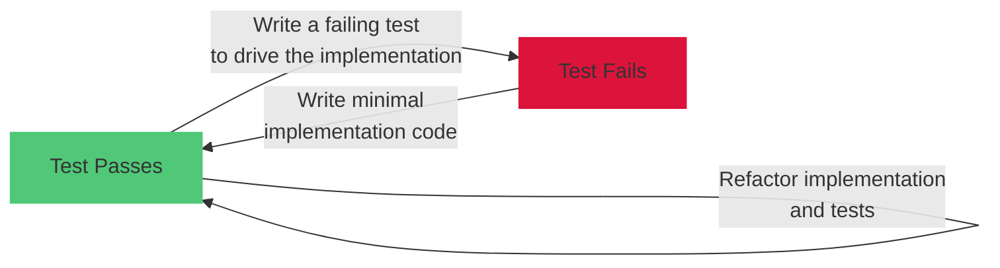

# Process

What is time-consuming when developing software is hesitation. The bottleneck of software development is the discovery of requirements,
and hesitation when writing implementation. A good process should enable the developer to avoid having to hesitate, and separate the
different concerns of the software development process.

## Content

Here is the gist of it:

### Some heuristics

- Defer naming when writing tests. We may throw them away.
- Be in good faith when writing the tests, and in bad faith when writing the solution
- Limit your bad faith to three occurrences
- Start by writing the tests and the solution in the same file
- Use tests as field notes of your understanding of the problem
- A green bar is a permission to think, do not think on a red bar

### Concerns to separate

- Documenting your understanding of the problem
- Having a first naive solution
- Having a first good design
- Having a first good solution
- Performance

## What is a test?

- A test is a question about the domain
- A test helps archeologists to understand the code, it is documentation
